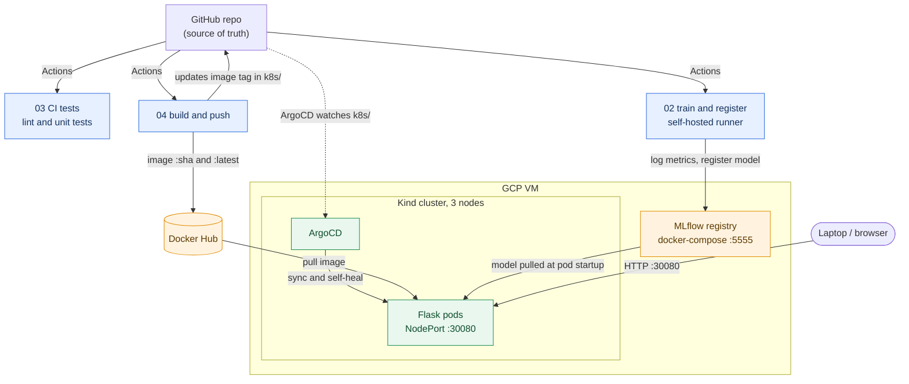

# Architecture and how I deploy it

This is the deployment side of things. The stage-by-stage map (which bit of my design maps to which code) is in `pipeline-stages.md`, and the exact setup commands are in `docs/gcp-setup-checklist.md`. What I'm doing here is drawing the picture of how the pieces fit together once it's all running.

## The pieces

I run everything on one GCP VM. I went with an n1-standard-4, which is about the smallest size that fine-tunes DistilBERT for me without falling over. On that VM I've got three things going on:

1. MLflow, under docker-compose, on port 5555. This is my tracking server and model registry, with a sqlite backend. That's plenty for a one-person project.
2. A self-hosted GitHub Actions runner. I run the training workflow here rather than on `ubuntu-latest`, because fine-tuning a transformer on the hosted runners is slow and tends to time out on me. I set this up following the week 8 self-hosted runner tutorial.
3. A 3-node Kind cluster (one control-plane, two workers) running ArgoCD and my Flask app. I took the cluster layout straight from the week 5 tutorial 2.

Docker Hub sits outside the VM. My build-push workflow pushes images there tagged by commit SHA, and the cluster pulls from it.

## How a change actually gets to production

This is the part I think is the most "MLOps" of the whole thing, so I want to spell it out.

When I merge something that touches the app code into `main`, my `04-build-push` workflow runs. It builds the image, tags it with the commit SHA and also `latest`, pushes both to Docker Hub, then rewrites the image line in `k8s/deployment.yaml` to point at the new SHA and commits that back. ArgoCD is watching the `k8s/` folder of this repo (this is the week 9 ArgoCD setup), so when the manifest changes it notices, syncs, and does a rolling update of the pods. I don't run `kubectl apply` by hand for a normal deploy.

The model is separate from all of that. The image does not contain the model. When a pod starts, my Flask app asks MLflow for the current Production model and loads it. So for me a model change and a code change are two different events, and pushing a new model live doesn't need a new image. That separation is the main thing I wanted to get right.

## One-time setup on the VM

I keep the exact commands in `docs/gcp-setup-checklist.md`, taken from the tutorials. At a high level what I do is provision the VM and open the ports, install Docker and docker-compose (the install-docker-on-gcp-vm tutorial), install kubectl and kind, register the self-hosted runner, bring up MLflow, create the Kind cluster, install ArgoCD, and apply `argoCD/application.yaml`. The first time through it's a fair bit of clicking, so I wrote every command out in that checklist rather than trusting myself to remember it all on the night.

## Ports I open

| port | what | why |
|---|---|---|
| 22 | SSH | get onto the VM |
| 30080 | NodePort for the Flask service | reach the app from a browser or curl |
| 5555 | MLflow UI | show the registry during the demo |
| 8080 | ArgoCD UI (port-forwarded) | show syncs during the demo |

For the demo flow itself (what I click, in what order) see `docs/demo-runbook.md`.
